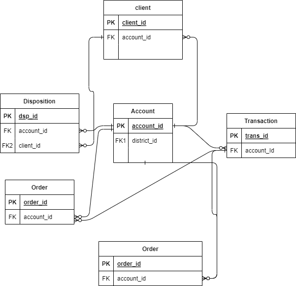
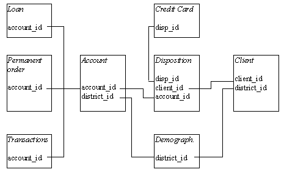

# Problem Definition:

<b> How can relational/hierarchical relationships be infered ? </b> 

<b> in other words, how can we make this: </b>




<b> look as close as possible to this (hopefully also convincing the good old customers):  </b>





## The example challenge:

<b> How can we infer more complex relationships such as these: </b>


## Contents

<p> - <b> main.py: </b> point of entry of the tool
<p> - <b> utils_loading.py: </b> basic data loader utils consisting of pandas wrappers and basic regex checks
<p> - <b> utils_schema.py: </b> functions used to infer schema with relevant formatting
<p> - <b> data: </b> directory expecting an arbitrary amount of (connected) tables. The berka dataset is currently its default, please remove all contents and replace with a hierarchical dataset of your choice (preferably the brazilian ecommerce dataset: https://www.kaggle.com/datasets/olistbr/brazilian-ecommerce)


## How to contribute:


<p> - <b> Step 1: </b> clone the repo
<p> - <b> Step 2: </b> git checkout into a new branch of your choice
<p> - <b> Step 3: </b> play around with berka (if you want to get a feel for what this mini-implementation does):

```
python main.py
```
<p> - <b> Step 4: </b> Download the brazilian dataset: https://www.kaggle.com/datasets/olistbr/brazilian-ecommerce
<p> - <b> Step 5: </b> Replace all the contents of the `data` folder with the brazilian data
<p> - <b> Step 6: </b> Open the main.py file and replace the seprator from ';' to ',' in line <b>13</b> as such:
```
sep = ','
```
<p> - <b> Step 7: </b> lets get hacking!


